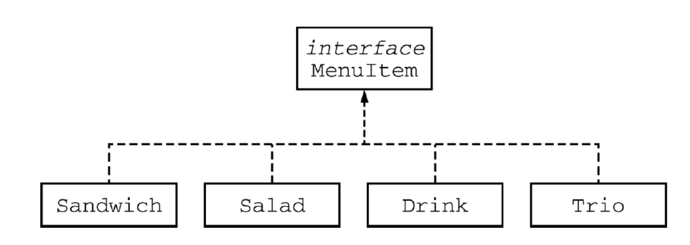

<!-- Check whether the assignment is ready to release -->
{{'now' | date: '%s'}}
{{page.release_date | date: '%s'}}
 
<div class="alert alert-danger">
Warning: this assignment is out of date.  It may still need to be updated for this year's class.  Check with your instructor before you start working on this assignment.
</div>

<!-- End of check whether the assignment is up to date -->


<!-- Check whether the assignment is up to date -->
<!--{{'now' | date: '%Y'}}
{{page.due_date | date: '%Y'}}
 
<div class="alert alert-danger">
Warning: this assignment is out of date.  It may still need to be updated for this year's class.  Check with your instructor before you start working on this assignment.
</div>
-->
<!-- End of check whether the assignment is up to date -->



<div class="alert alert-info">
You can download the materials for this assignment here:
<ul>

<li><a href="{{item.url}}">{{ item.name }}</a></li>

</ul>

</div>



{{page.type}} {{page.number}}: {{page.title}}
=============================================================


## Objectives:

The main goals for this lab are:

1. Practice with Interfaces
1. Implement a Custom Exception

You will need to have a TA check off on all your exercises.
If you do not complete the lab during the lab session, you
must have a TA check off all your exercises during office hours.
You must get this lab checked off by the due date for HW03.

> Notes: in this lab you are not allowed to include any `import` statements unless specified.

### Paired Programming rules
This lab is a **paired programming assignment.** What exactly does that mean? 
You will be working in pairs on the CS lab computers. Each pair will be working on one computer. One person will be the **driver** and the other person
 will be the **navigator**. Here is the rule: the **driver** controlls the lab computer, but the **driver** can only type what the **navigator** tells 
them to type. For this to work well, each pair should be constantly talking 
among themselves. After each problem, you will switch roles, the navigator will become the driver and the driver will become the navigator.

> **Switching Partners This Week**
> Please find a new partner. You will working with this partner for the next 3 weeks. In 3 weeks time we will switch partners again.


The menu at a lunch counter includes a variety of sandwiches, salads, and drinks. The menu also allows
a customer to create a “trio,” which consists of three menu items, one of each category: a sandwich, a
salad, and a drink. Each menu item has a name and a price. The four types of menu items are
represented by the four classes `Sandwich`, `Salad`, `Drink`, and `Trio`. All four classes implement the
following `MenuItem` interface.

```
public interface MenuItem {
/**
* @returns the name of the menu item
*/
String getName();
/**
* @return the price of the menu item
*/
double getPrice();
}
```

We can download the interface online from
<a href="{{ site.url }}{{ site.baseurl }}/labs/lab04/MenuItem.java">{{ site.url }}{{ site.baseurl }}/labs/lab04/MenuItem.java</a>

The following diagram shows the relationship between the MenuItem interface and the Sandwich,
Salad, Drink, and Trio classes:



For example, assume that the menu includes the following items. The objects listed under each heading
are instances of the class indicated by the heading:


The name of the `Trio` consists of the names of the sandwich, salad, and drink, in that order, each
separated by “/” and followed by a space and then “Trio”. The price of the `Trio` is the sum of the two
highest-priced items in the `Trio`; one item with the lowest price is free. A trio consisting of a
cheeseburger, spinach salad, and an orange soda would have the name "Cheeseburger/Spinach
Salad/Orange Soda Trio" and a price of $4.00 (the two highest prices are $2.75 and $1.25).
Similarly, a trio consisting of a club sandwich, coleslaw, and a cappuccino would have the name "Club
Sandwich/Coleslaw/Cappuccino Trio" and a price of $6.25 (the two highest prices are $2.75
and $3.50).

## Exercise 1

Implement the `Sandwich`, `Salad` and `Drink` classes as specified. Test with the
following driver program:

```java
public static void main(String[] args) {
  Sandwich burger = new Sandwich("Cheeseburger",2.75);
  Sandwich club = new Sandwich("Club Sandwich", 2.75);
  Salad spinachSalad = new Salad("Spinach Salad",1.25);
  Salad coleslaw = new Salad("Coleslaw", 1.25);
  Drink orange = new Drink("Orange Soda", 1.25);
  Drink cap = new Drink("Cappuccino", 3.50);
  System.out.println(burger.getName()+ " " + burger.getPrice());
  System.out.println(club.getName()+ " " + club.getPrice());
  System.out.println(spinachSalad.getName()+ " " +
                     spinachSalad.getPrice());
  System.out.println(coleslaw.getName()+ " " +
                     coleslaw.getPrice());
  System.out.println(orange.getName()+ " " + orange.getPrice());
  System.out.println(cap.getName()+ " " + cap.getPrice());
}
```

You can download the driver from <a href="{{ site.url }}{{ site.baseurl }}/labs/lab04/Lab4.java">{{ site.url }}{{ site.baseurl }}/labs/lab04/Lab4.java</a>

## Exercise 2: Trio Class
Implement the `Trio` class as specified. Test with the following driver program:

```java
public static void main(String[] args) {
  Sandwich burger = new Sandwich("Cheeseburger",2.75);
  Sandwich club = new Sandwich("Club Sandwich", 2.75);
  Salad spinachSalad = new Salad("Spinach Salad",1.25);
  Salad coleslaw = new Salad("Coleslaw", 1.25);
  Drink orange = new Drink("Orange Soda", 1.25);
  Drink cap = new Drink("Cappuccino", 3.50);
  Trio trio1 = new Trio(burger, spinachSalad, orange);
  System.out.println(trio1.getName());
  System.out.println(trio1.getPrice());
  Trio trio2 = new Trio(club,coleslaw,cap);
  System.out.println(trio2.getName());
  System.out.println(trio2.getPrice());
}
```

## Exercise 3: IllegalTrioException
Modify the `Trio` class so that it throws a `IllegalTrioException` when
anyone attempts to create a `Trio` combining three items of the same price (I don’t know why,
because giving away a third that’s not “cheaper” isn’t allowed? – no, I just needed to make up a
reason for you to custom-design an exception!). Provide code in your driver to test it.

## Exercise 4: Comparable 
Modify the `Trio` class to also implement `Comparable`. The ordering of the
`Trios` depends on their prices – the more expensive `Trio` is “larger”. 
The distance between `Trio`s should be based on the price difference.
Provide code in your
driver to test it. Feel free to make up lots more sandwiches, salads and drinks to have some
variety. Putting a bunch of `Trios` in an array and then call `Array.sort` on them is a good
way to test.

> Note: You can import `java.util.Arrays` to test your implementation here. 

## Wrap up

In todays lab we covered Interfaces, Creating Custom Exceptions, and Comparable.

### Signing out
Before leaving, make sure your TA/instructor have signed you out of the lab. If you finish the lab early, you are free to go.
If you do not finish the lab in time, you will need to go to office hours so
that a TA can check your work.


